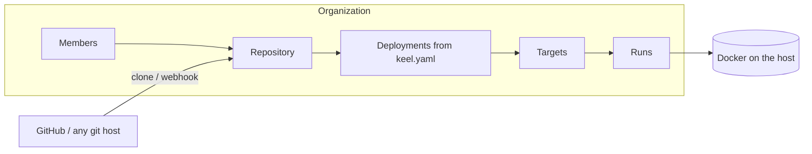

Keel Dev is for one person and one repository. Keel Cloud is what you run
when a team — or a company and its clients — needs to deploy from a browser,
with an audit trail, without anyone installing tools or holding credentials.

It is the same engine and the same UI, served from a server you control,
backed by PostgreSQL, and extended with:

- **Organizations** — a personal one on sign-up, more on demand, each with
  members, roles, and invite links.
- **Roles and scopes** — owners and admins manage; members deploy or
  configure only with the matching scope; everyone else views.
- **Connected repositories** — any git host over HTTPS with an optional
  read token, or a GitHub App with a repository picker.
- **Push-triggered deploys** — targets flagged *auto-deploy on push* run
  when their branch receives a push, if their variables are complete.
- **Runs on the server** — fresh clone per run, Docker on the host, live
  logs over SSE, persisted history, secret masking, per-target concurrency.

## How it fits together

Repositories belong to organizations. Connecting one clones its branch,
reads `keel.yaml`, and lists the deployments it declares. Targets and values
are created against those deployments, exactly as in Keel Dev.

## Getting a Keel Cloud

<Columns cols={2}>
  <Card title="Self-host" icon="server" href="/cloud/self-hosting">
    Docker Compose in a minute for evaluation; a binary or container image behind a TLS proxy for production.
  </Card>
  <Card title="Let Keel deploy it" icon="wand-magic-sparkles" href="/cloud/deploy-on-google-cloud">
    Keel's own repository ships a deployment that stands up a production Keel Cloud on a single Google Cloud VM for about $35 a month.
  </Card>
</Columns>

## Then

<Columns cols={2}>
  <Card title="Organizations and permissions" icon="users" href="/cloud/organizations-and-permissions">
    Who can do what, and how to invite people.
  </Card>
  <Card title="Connect repositories" icon="code-branch" href="/cloud/connect-repositories">
    Git URLs, tokens, branches, syncing, and repository status.
  </Card>
  <Card title="GitHub App" icon="github" href="/cloud/github-app">
    The repository picker and push-triggered deploys.
  </Card>
  <Card title="Runs and security" icon="shield-halved" href="/cloud/runs-and-security">
    How runs execute on the host and what the trust boundary is.
  </Card>
</Columns>
