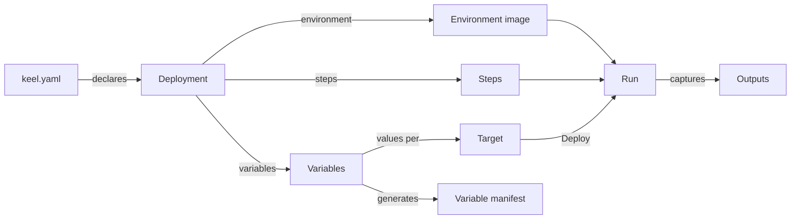

Keel has a small number of moving parts, and every feature maps onto one of
them.

## The configuration is the source of truth

`keel.yaml` lives at the repository root and is versioned with the code. It
declares one or more **deployments**. Each deployment names:

- an **environment** — a Dockerfile in the repository that installs every
  tool the steps need;
- ordered **steps** — shell scripts executed inside that environment;
- **variables** — the inputs the steps read as environment variables, with
  types, validation, defaults, and documentation;
- optional **outputs** — environment variables to capture when a run
  succeeds.

Keel Dev re-reads the file on every page load. Keel Cloud reads it from the
connected branch on every sync and on every push. Nothing about a deployment
is configured in the UI; the UI renders what the file says.

## Targets hold the values

A **target** is one concrete destination for a deployment — `client-acme`,
`staging`, `eu-cluster`. Targets are created in the UI and belong to a
deployment. Each target stores its own value for every variable, encrypted at
rest, and keeps its own run history.

A target is **ready** when every required, active configuration variable has
a value or a default. Until then the deploy button stays disabled and the UI
says how many values are still needed.

## A run executes the steps

Pressing **Deploy** (or running `keel deploy`) starts a **run**:

1. **Build.** The environment image is built from the deployment's
   Dockerfile with the repository as build context. Image tags are stable
   per deployment, so Docker layer caching keeps repeat builds fast.
2. **Run.** A container starts from that image with the repository mounted
   read-write at `/workspace` and every variable exported. The steps execute
   in order with `/bin/sh`; a step that exits non-zero fails the run and
   skips the rest.
3. **Capture.** When every step succeeded, the declared outputs are read from
   the container's final environment and stored with the run.

Logs stream live to the browser (or the terminal), with every secret value
masked. Runs can be canceled, which removes the container.

## Manifests describe what to supply

Because the variables carry descriptions, "why", and "how" text, Keel can
generate a **variable manifest**: a Markdown or HTML document listing the
values a client or another team must provide, in their language, without
exposing the repository.

## What lives where

| | Keel Dev | Keel Cloud |
|---|---|---|
| Configuration | `keel.yaml` in the working directory | `keel.yaml` on the connected branch, re-read on sync and push |
| Targets, values, runs, logs | `.keel/dev.db` (SQLite) in the repository | PostgreSQL |
| Encryption key | `keel/dev.key` under the user's config directory | `KEEL_ENCRYPTION_KEY`, or a generated file in `KEEL_DATA_DIR` |
| Repository during a run | the working tree itself, mounted read-write | a fresh shallow clone per run, deleted afterwards |
| Docker | the local daemon | the daemon on the Keel Cloud host |

<Info>
  In Keel Dev the run works on your actual working tree, uncommitted changes
  included. That is convenient while authoring and something to remember
  before pressing Deploy with a half-finished script in the tree.
</Info>
